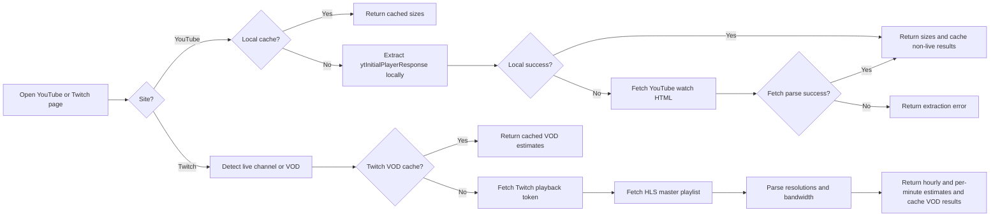

# TubeSize

**Know exactly how much internet data a YouTube or Twitch stream will use before you press play.**

---
TubeSize is a browser extension that shows estimated data usage for YouTube and Twitch directly in a popup without leaving the page.

## Installation

<table width="100%">
  <tr>
    <td valign="top" width="33%">
      <strong>Chrome Web Store</strong> 
      Install the Chromium build for Chrome.  
      
    </td>
    <td valign="top" width="33%">
      <strong>Firefox Add-ons</strong> 
      Install the Firefox package from Mozilla Add-ons.  
      
    </td>
    <td valign="top" width="33%">
      <strong>Edge Add-ons</strong> 
      Install the Chromium build for Microsoft Edge.  
      
    </td>
  </tr>
</table>

---

## Screenshots

  

 

  
  

---

## Features

- **YouTube Videos Support**: see estimated data usage for each video quality
- **Twitch Support**: compare data usage across stream qualities
- **Live Streams**: check usage estimates for YouTube Live and Twitch live
- **Data Usage Warning**: get alerted when a quality uses too much data
- **Quality Menu**: view size info directly inside YouTube’s quality menu
- **Shortcut**: open the popup anytime with Alt+P
- **Browsers**: use it on Chrome, Firefox, and Edge
---
## Permissions

The extension requests the minimum permissions required:

| Permission                          | Why                                                                       |
| ----------------------------------- | ------------------------------------------------------------------------- |
| `activeTab`                         | Read the current tab's URL to detect the current YouTube or Twitch page   |
| `storage`                           | Cache YouTube data and user preferences locally                           |
| `host_permissions: *.youtube.com`   | Read YouTube pages and extract stream metadata locally                    |
| `host_permissions: *.twitch.tv`     | Read Twitch live/VOD pages and request Twitch playback metadata           |
| `host_permissions: usher.ttvnw.net` | Fetch Twitch HLS playlists to inspect available resolutions and bandwidth |
| `host_permissions: gql.twitch.tv`   | Request Twitch playback access tokens                                     |
---
## Stack

TubeSize is currently an extension-first project. The legacy API under `api/` is deprecated and not used by the extension.

| Layer        | Technology                                                                |
| ------------ | ------------------------------------------------------------------------- |
| Extension UI | React, TypeScript, Vite                                                   |
| Testing      | Jest                                                                      |
| Linting      | ESLint, Knip, Prettier                                                    |
| Storage      | `chrome.storage.local`, `chrome.storage.sync`                             |
| YouTube Data | `ytInitialPlayerResponse` parsing with direct YouTube HTML fetch fallback |
| Twitch Data  | Twitch GQL playback tokens + HLS playlist parsing                         |
| Packaging    | `vite-plugin-web-extension`, zip packaging                                |
| CI/CD        | GitHub Actions                                                            |

## How It Works

TubeSize uses two retrieval paths depending on the site.

### Resolution & Codec Support

TubeSize resolves standard YouTube adaptive-streaming itags:

| Resolution | Itags checked (priority order) |
| ---------- | ------------------------------ |
| 144p       | 394, 330, 278, 160             |
| 240p       | 395, 331, 242, 133             |
| 360p       | 396, 332, 243, 134             |
| 480p       | 397, 333, 244, 135             |
| 720p       | 398, 334, 302, 247, 298, 136   |
| 1080p      | 399, 335, 303, 248, 299, 137   |
| 1440p      | 400, 336, 308, 271, 304, 264   |
| 2160p (4K) | 401, 337, 315, 313, 305, 266   |
| 4320p (8K) | 402, 571, 272, 138             |

For regular YouTube videos, audio size is determined by averaging all available `itag 251` (Opus 160kbps) streams returned by YouTube and is added to every video format.

For YouTube Live streams, TubeSize estimates both audio and video usage from bitrate data when content length is not available.

For Twitch live streams and VODs, TubeSize reads the HLS playlist variants exposed by Twitch and reports the available resolutions with approximate transfer usage derived from each variant bandwidth.

---
### Legacy API
The extension used to rely on an API that used yt-dlp to retrieve video data. The API is now deprecated and not used in the extension

---

## Author

**Mohammed Sayed**

- GitHub: [@MohamedSayed0573](https://github.com/MohamedSayed0573)
- LinkedIn: [mohamed-sayed3](https://www.linkedin.com/in/mohamed-sayed3/)
- Support: [ko-fi.com/mohamedsayed253](https://ko-fi.com/mohamedsayed253)

---

## License

[MIT](LICENSE)
