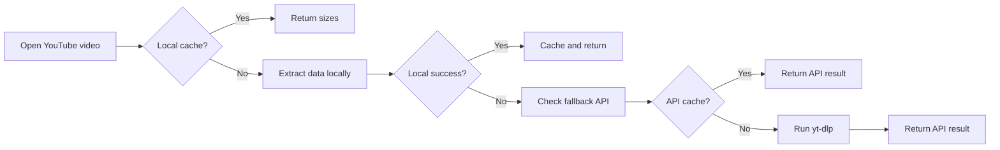

<div align="center">


# TubeSize

[](https://github.com/MohamedSayed0573/Tubesize_Extension/releases)

**Know exactly how much data a YouTube video will cost you — before you press play.**

[](https://chromewebstore.google.com/detail/tubesize/bdpkcpbkonollfbgcnkknkjdbfpacnoi)
[](https://addons.mozilla.org/en-US/firefox/addon/tubesize/)
[](https://microsoftedge.microsoft.com/addons/detail/tubesize/mljmdmlkjajlklcaipidodlkfkcippka)
[](LICENSE)
[](https://www.typescriptlang.org/)
[](https://developer.chrome.com/docs/extensions/mv3/)

[](https://ko-fi.com/mohamedsayed253) 

</div>

---

TubeSize is a browser extension that shows you the estimated file size of any YouTube video — across every available quality — directly in a popup, without leaving the page. No trackers, no sign-in, no third-party analytics. It works locally first, and only ever reaches out to a self-hosted backup API when the client-side extraction has exhausted every option.

## Screenshots

<div align="center">
  
</div>

---

## Features

- **Per-resolution file sizes** — 144p through 8K (4320p), with audio already merged in
- **Size ranges at 1080p+** — when multiple encoding formats exist for a resolution (e.g. AV1, VP9, H.264), the popup shows the smallest–largest range so you can compare
- **Client-first, privacy-respecting** — metadata is extracted directly from the YouTube page; no data is sent anywhere unless local extraction fails
- **Local cache** — results are stored in `chrome.storage.local` with a configurable TTL (default: 3 days) so repeat views are instant
- **Self-hosted fallback API** — if client-side extraction fails, an optional backup API powered by `yt-dlp` and deployed on AWS EC2 takes over silently
- **Cross-browser** — Chrome, Firefox, and Edge are all supported from the same codebase (Manifest V3 for Chromium, adapted manifest for Firefox)
- **Keyboard shortcut** — open the popup at any time with `Ctrl+Shift+0` (`Cmd+Shift+0` on Mac)

---

## Installation

| Store            | Link                                                                                                   |
| ---------------- | ------------------------------------------------------------------------------------------------------ |
| Chrome Web Store | [Install](https://chromewebstore.google.com/detail/tubesize/bdpkcpbkonollfbgcnkknkjdbfpacnoi)          |
| Firefox Add-ons  | [Install](https://addons.mozilla.org/en-US/firefox/addon/tubesize/)                                    |
| Edge Add-ons     | [Install](https://microsoftedge.microsoft.com/addons/detail/tubesize/mljmdmlkjajlklcaipidodlkfkcippka) |

---

## Stack

TubeSize is built as a browser extension with a self-hosted fallback API.

| Layer            | Technology                                                |
| ---------------- | --------------------------------------------------------- |
| Extension        | React, TypeScript, Vite, Jest                             |
| API Runtime      | Node.js + TypeScript                                      |
| API Framework    | Fastify                                                   |
| Validation       | Zod                                                       |
| Video Metadata   | `yt-dlp` (spawned as a subprocess on the server)          |
| Caching          | `chrome.storage.local` on the extension, Redis on the API |
| Security         | `@fastify/helmet`, `@fastify/cors`, rate limiting         |
| Containerisation | Docker (multi-stage: dev / staging / prod)                |
| Hosting          | AWS EC2                                                   |
| CI/CD            | GitHub Actions                                            |
| API Docs         | OpenAPI 3 / Swagger UI (`/api-docs/swagger`)              |

## How It Works

TubeSize uses a **client-first resolution strategy**: local first, API only as a fallback.



### Resolution & Codec Support

TubeSize resolves all standard YouTube adaptive-streaming itags:

| Resolution | Itags checked (priority order) |
| ---------- | ------------------------------ |
| 144p       | 394, 330, 278, 160             |
| 240p       | 395, 331, 242, 133             |
| 360p       | 396, 332, 243, 134             |
| 480p       | 397, 333, 244, 135             |
| 720p       | 398, 334, 302, 247, 298, 136   |
| 1080p      | 399, 335, 303, 248, 299, 137   |
| 1440p      | 400, 336, 308, 271, 304, 264   |
| 2160p (4K) | 401, 337, 315, 313, 305, 266   |
| 4320p (8K) | 402, 571, 272, 138             |

Audio size is determined by averaging all available `itag 251` (Opus 160kbps) streams returned by YouTube and is added to every video format.

## Backend API

The fallback API is a standalone **Fastify + TypeScript** server that runs on **AWS EC2** inside a Docker container. It is called only when the extension cannot extract video data locally.

### Endpoint

```
GET /api/video-sizes/:videoTag
    ?humanReadableSizes=true   # default true
    ?mergeAudioWithVideo=true  # default true
```

The server validates the video ID format, checks Redis for a cached result, otherwise spawns `yt-dlp --skip-download -J` to fetch stream metadata, formats the response, writes to Redis (TTL-controlled), and returns it.

### CI/CD Pipeline

Two GitHub Actions workflows handle the full release lifecycle:

**`deploy.yml` — API deployment**

- Triggered on every push to any branch (→ staging) or on `api-v*` tags (→ production)
- Builds a Docker image, pushes it to Docker Hub, then SSH-deploys it to EC2 via `docker compose up -d`
- Production and staging share the same image; the target stage (`prod` / `staging`) is resolved at build time from the git ref

**`release.yml` — Extension packaging**

- Triggered on `extension-v*.*.*` tags
- Installs dependencies, runs the Jest test suite, builds Chrome and Firefox packages, and publishes them as a GitHub Release

---

## Permissions

The extension requests the minimum permissions required:

| Permission                                | Why                                                                                   |
| ----------------------------------------- | ------------------------------------------------------------------------------------- |
| `activeTab`                               | Read the current tab's URL to extract the video ID                                    |
| `storage`                                 | Cache video data and user preferences locally                                         |
| `host_permissions: *.youtube.com`         | Inject the content script; fetch the YouTube page from the service worker when needed |
| `host_permissions: api.mohammedsayed.dev` | Call the optional self-hosted fallback API                                            |

---

## Local Development

### Prerequisites

- Node.js `20.x`
- pnpm `10.x`
- For the API: Docker, Redis, `yt-dlp`

### Extension

```bash
git clone https://github.com/MohamedSayed0573/TubeSize_Extension.git
cd TubeSize_Extension
pnpm install

# Development build with watch
cd tubesize && pnpm run dev

# Production build
pnpm run build

# Run tests
pnpm run test
```

Load the `tubesize/dist/` folder as an unpacked extension in your browser.

### API

```bash
docker compose -f api/docker-compose.dev.yml up
```

### Package for Release

```bash
# Chrome / Edge
cd tubesize && pnpm run pack

# Firefox
cd tubesize && pnpm run pack:firefox
```

---

## Author

**Mohammed Sayed**

- GitHub: [@MohamedSayed0573](https://github.com/MohamedSayed0573)
- LinkedIn: [mohamed-sayed3](https://www.linkedin.com/in/mohamed-sayed3/)

---

## License

[MIT](LICENSE)
