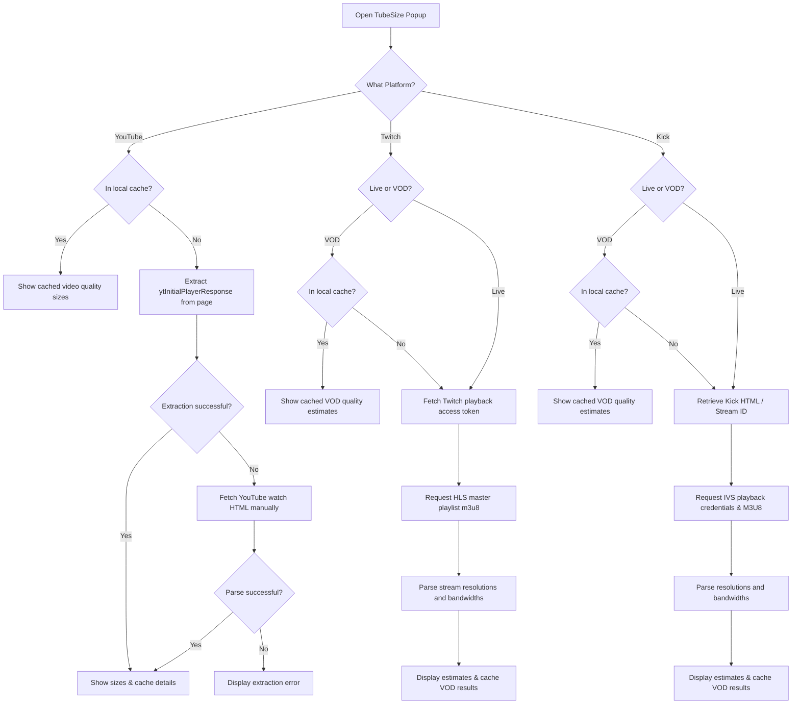
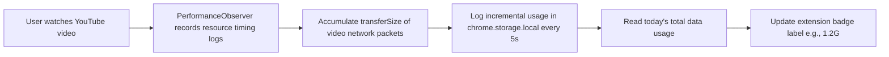

# TubeSize

**Know exactly how much internet data a YouTube, Twitch, or Kick stream will use before you press play.**

---

TubeSize is a lightweight, premium browser extension that estimates data usage and file sizes for YouTube, Twitch, and Kick streams in real-time. It features an interactive daily usage analytics dashboard, custom threshold data alerts, and direct integration into video players.

## Installation

<table width="100%">
  <tr>
    <td valign="top" width="33%">
      <strong>Chrome Web Store</strong> 
      Install the Chromium build for Chrome.  
      
    </td>
    <td valign="top" width="33%">
      <strong>Firefox Add-ons</strong> 
      Install the Firefox package from Mozilla Add-ons.  
      
    </td>
    <td valign="top" width="33%">
      <strong>Edge Add-ons</strong> 
      Install the Chromium build for Microsoft Edge.  
      
    </td>
  </tr>
</table>

---

## Screenshots

  

 

  
  

---

## Features

- **YouTube Quality Estimates**: View calculated file sizes for standard resolutions on video pages, Shorts, and Live streams.
- **Twitch Stream Diagnostics**: Compare data consumption across resolutions for live streams and VODs.
- **Kick Platform Support (New)**: Compare data usage estimates for Kick live streams and VODs using HLS stream bandwidth profiles.
- **Data Usage Analytics Dashboard (New)**: Track your daily YouTube data usage dynamically. View usage metrics across:
    - Today, Last 7 Days, Last 30 Days, and Lifetime totals.
    - Interactive daily bandwidth consumption graphs built with Recharts.
    - Granular breakdown of videos watched, complete with thumbnails, channel names, and exact data consumed.
- **Dynamic Badge Counter (New)**: View your real-time cumulative daily YouTube bandwidth consumption directly on the extension icon's badge (e.g., `1.2G` or `450M`).
- **Bandwidth Warning Toasts**: Set data thresholds in Settings and receive automated notifications if a stream's bitrate exceeds your limits.
- **Quality Menu Integration**: Embed calculated file size details directly inside YouTube's native player settings and quality selection dropdowns.
- **Keyboard Shortcut**: Open the TubeSize extension popup at any time using `Alt+P` (or custom hotkey).
- **Modern Options Panel**: Customize cache time-to-live (TTL), adjust notification triggers, clear analytics/caches, and filter custom streaming qualities.

---

## Permissions

The extension requests the minimum permissions required to perform client-side analysis and local usage tracking:

| Permission                                          | Why                                                                   |
| :-------------------------------------------------- | :-------------------------------------------------------------------- |
| `activeTab`                                         | Read the current tab's URL to detect YouTube, Twitch, or Kick pages.  |
| `storage`                                           | Cache stream metadata, user preferences, and usage analytics locally. |
| `host_permissions: *.youtube.com`                   | Read YouTube pages and parse player initial configurations locally.   |
| `host_permissions: *.twitch.tv`                     | Query Twitch GQL APIs to retrieve stream token hashes.                |
| `host_permissions: gql.twitch.tv`                   | Request authorization payloads for Twitch stream playbacks.           |
| `host_permissions: usher.ttvnw.net`                 | Retrieve HLS master playlists to map resolutions and bitrates.        |
| `host_permissions: *.playlist.ttvnw.net`            | Read dynamic stream playlist streams.                                 |
| `host_permissions: *.cloudfront.hls.ttvnw.net`      | Connect to Twitch media CDNs for packet analysis.                     |
| `host_permissions: *.kick.com`                      | Fetch Kick channel, live stream HTML, and VOD session records.        |
| `host_permissions: *.playback.live-video.net`       | Retrieve Kick live master M3U8 streams via the IVS Player API.        |
| `host_permissions: *.cloudfront.hls.live-video.net` | Analyze Kick video chunks on Amazon Interactive Video Service.        |

---

## Technology Stack

TubeSize is an modern, extension-first project. The legacy API under `api/` is fully deprecated and is no longer used by the extension.

| Layer                 | Technology                                                                                         |
| :-------------------- | :------------------------------------------------------------------------------------------------- |
| **Frontend & UI**     | React 19, TypeScript, Vite, React Router v7, Recharts, CSS Variables                               |
| **Testing**           | Jest, ts-jest, jest-extended                                                                       |
| **Linting & Tooling** | ESLint 10, Knip, Prettier, Husky, Lint-Staged                                                      |
| **Local Cache**       | `chrome.storage.local` (media cache, daily analytics) and `chrome.storage.sync` (user preferences) |
| **Data Parsing**      | Zod (schema verification) & `m3u8-parser` (Twitch/Kick streams)                                    |
| **Packaging**         | `@crxjs/vite-plugin` (Manifest V3 integration), zip packaging                                      |
| **CI/CD**             | GitHub Actions                                                                                     |

---

## How It Works

### Size Retrieval Flow

TubeSize performs completely client-side extraction to estimate resolution-specific streaming filesizes:

### Real-Time YouTube Analytics & Badge Flow

Bandwidth usage tracking runs fully locally in your browser to maintain strict privacy:

---

### Resolution & Codec Support

#### YouTube

TubeSize resolves standard YouTube adaptive-streaming itags:

| Resolution | Itags checked (priority order) |
| :--------- | :----------------------------- |
| 144p       | 394, 330, 278, 160             |
| 240p       | 395, 331, 242, 133             |
| 360p       | 396, 332, 243, 134             |
| 480p       | 397, 333, 244, 135             |
| 720p       | 398, 334, 302, 247, 298, 136   |
| 1080p      | 399, 335, 303, 248, 299, 137   |
| 1440p      | 400, 336, 308, 271, 304, 264   |
| 2160p (4K) | 401, 337, 315, 313, 305, 266   |
| 4320p (8K) | 402, 571, 272, 138             |

For regular YouTube videos, audio size is determined by averaging all available `itag 251` (Opus 160kbps) streams returned by YouTube and is added to every video format. For YouTube Live streams, TubeSize estimates both audio and video usage from bitrate data when content length is not available.

#### Twitch & Kick

For Twitch and Kick live streams and VODs, TubeSize reads the HLS playlist variants exposed by the streaming APIs and reports the available resolutions with approximate transfer usage derived from each variant's bandwidth (e.g., resolving resolutions like 1080p60, 720p60, 720p, 480p, 360p, 160p).

---

## Author

**Mohammed Sayed**

- GitHub: [@MohamedSayed0573](https://github.com/MohamedSayed0573)
- LinkedIn: [mohamed-sayed3](https://www.linkedin.com/in/mohamed-sayed3/)
- Support: [ko-fi.com/mohamedsayed253](https://ko-fi.com/mohamedsayed253)

---

## License

[MIT](LICENSE)
