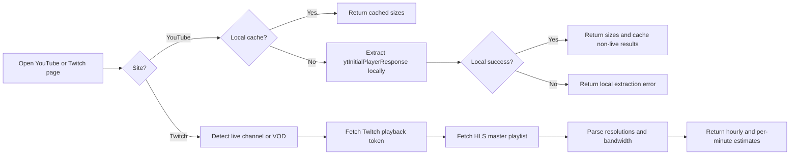

<div align="center">


# TubeSize


**Know exactly how much data a YouTube or Twitch stream/video will cost you before you press play.**

[](https://chromewebstore.google.com/detail/tubesize/bdpkcpbkonollfbgcnkknkjdbfpacnoi)
[](https://addons.mozilla.org/en-US/firefox/addon/tubesize/)
[](https://microsoftedge.microsoft.com/addons/detail/tubesize/mljmdmlkjajlklcaipidodlkfkcippka)
[](LICENSE)
[](https://www.typescriptlang.org/)
[](https://developer.chrome.com/docs/extensions/mv3/)

[](https://ko-fi.com/mohamedsayed253)

</div>

---

TubeSize is a browser extension that shows estimated data usage for YouTube and Twitch directly in a popup without leaving the page.

## Screenshots

<div align="center">
  
</div>

---

## Features

- **YouTube videos** — per-resolution file sizes from 144p through 8K (4320p), with audio already merged in
- **YouTube Live support** — estimates live data usage per quality using bitrate-derived hourly and per-minute usage
- **Twitch live support** — reads Twitch HLS playlists and shows estimated bandwidth usage per quality level
- **Twitch VOD support** — works on `twitch.tv/videos/...` pages in the same popup flow
- **Client-first, privacy-respecting** — YouTube metadata is extracted directly from the page and Twitch data is pulled from Twitch playback endpoints
- **Local cache for YouTube** — YouTube results are stored in `chrome.storage.local` with a configurable TTL (default: 3 days) so repeat views are instant
- **Deprecated backup API** — the old YouTube fallback API is still in the repository, but extension builds no longer use it
- **Cross-browser** — Chrome, Firefox, and Edge are all supported from the same codebase (Manifest V3 for Chromium, adapted manifest for Firefox)
- **Keyboard shortcut** — open the popup at any time with `Ctrl+Shift+0` (`Cmd+Shift+0` on Mac)

---

## Installation

| Store            | Link                                                                                                   |
| ---------------- | ------------------------------------------------------------------------------------------------------ |
| Chrome Web Store | [Install](https://chromewebstore.google.com/detail/tubesize/bdpkcpbkonollfbgcnkknkjdbfpacnoi)          |
| Firefox Add-ons  | [Install](https://addons.mozilla.org/en-US/firefox/addon/tubesize/)                                    |
| Edge Add-ons     | [Install](https://microsoftedge.microsoft.com/addons/detail/tubesize/mljmdmlkjajlklcaipidodlkfkcippka) |

---

## Stack

TubeSize is built primarily as a browser extension. The old fallback API remains in the repository but is currently deprecated and not used by the extension.

| Layer            | Technology                                                |
| ---------------- | --------------------------------------------------------- |
| Extension        | React, TypeScript, Vite, Jest                             |
| API Runtime      | Node.js + TypeScript                                      |
| API Framework    | Fastify                                                   |
| Validation       | Zod                                                       |
| Video Metadata   | `yt-dlp` (spawned as a subprocess on the server)          |
| Caching          | `chrome.storage.local` on the extension, Redis on the API |
| Security         | `@fastify/helmet`, `@fastify/cors`, rate limiting         |
| Containerisation | Docker (multi-stage: dev / staging / prod)                |
| Hosting          | AWS EC2                                                   |
| CI/CD            | GitHub Actions                                            |
| API Docs         | OpenAPI 3 / Swagger UI (`/api-docs/swagger`)              |

## How It Works

TubeSize uses two retrieval paths depending on the site.



### Supported Pages

- YouTube watch pages
- YouTube Shorts
- YouTube Live streams
- Twitch live channel pages
- Twitch VOD pages at `twitch.tv/videos/:id`

### YouTube Path

For YouTube, TubeSize uses a fully local strategy: it extracts `ytInitialPlayerResponse` locally, builds a resolution table, merges audio into video sizes, and caches non-live results.

For YouTube Live streams, exact file size is not available the same way as on-demand videos, so TubeSize derives an estimate from the advertised stream bitrate and presents usage as hourly and per-minute estimates.

### Twitch Path

For Twitch live channels and VODs, TubeSize fetches a playback access token, requests the HLS master playlist, and parses the available variants to show estimated usage per resolution.

Twitch entries are currently presented as approximate bandwidth usage per hour and per minute.

### Resolution & Codec Support

TubeSize resolves standard YouTube adaptive-streaming itags:

| Resolution | Itags checked (priority order) |
| ---------- | ------------------------------ |
| 144p       | 394, 330, 278, 160             |
| 240p       | 395, 331, 242, 133             |
| 360p       | 396, 332, 243, 134             |
| 480p       | 397, 333, 244, 135             |
| 720p       | 398, 334, 302, 247, 298, 136   |
| 1080p      | 399, 335, 303, 248, 299, 137   |
| 1440p      | 400, 336, 308, 271, 304, 264   |
| 2160p (4K) | 401, 337, 315, 313, 305, 266   |
| 4320p (8K) | 402, 571, 272, 138             |

For regular YouTube videos, audio size is determined by averaging all available `itag 251` (Opus 160kbps) streams returned by YouTube and is added to every video format.

For YouTube Live streams, TubeSize estimates both audio and video usage from bitrate data when content length is not available.

For Twitch live streams and VODs, TubeSize reads the HLS playlist variants exposed by Twitch and reports the available resolutions with approximate transfer usage derived from each variant bandwidth.

## Backend API

The fallback API is a standalone **Fastify + TypeScript** server that runs on **AWS EC2** inside a Docker container.

It is currently deprecated and is no longer used by the extension.

### Endpoint

```
GET /api/video-sizes/:videoTag
    ?humanReadableSizes=true   # default true
    ?mergeAudioWithVideo=true  # default true
```

The server validates the video ID format, checks Redis for a cached result, otherwise spawns `yt-dlp --skip-download -J` to fetch stream metadata, formats the response, writes to Redis (TTL-controlled), and returns it.

### CI/CD Pipeline

Two GitHub Actions workflows handle the full release lifecycle:

**`deploy.yml` — API deployment**

- Triggered on every push to any branch (→ staging) or on `api-v*` tags (→ production)
- Builds a Docker image, pushes it to Docker Hub, then SSH-deploys it to EC2 via `docker compose up -d`
- Production and staging share the same image; the target stage (`prod` / `staging`) is resolved at build time from the git ref

**`release.yml` — Extension packaging**

- Triggered on `extension-v*.*.*` tags
- Installs dependencies, runs the Jest test suite, builds Chrome and Firefox packages, and publishes them as a GitHub Release

---

## Permissions

The extension requests the minimum permissions required:

| Permission                          | Why                                                                       |
| ----------------------------------- | ------------------------------------------------------------------------- |
| `activeTab`                         | Read the current tab's URL to detect the current YouTube or Twitch page   |
| `storage`                           | Cache YouTube data and user preferences locally                           |
| `host_permissions: *.youtube.com`   | Read YouTube pages and extract stream metadata locally                    |
| `host_permissions: *.twitch.tv`     | Read Twitch live/VOD pages and request Twitch playback metadata           |
| `host_permissions: usher.ttvnw.net` | Fetch Twitch HLS playlists to inspect available resolutions and bandwidth |
| `host_permissions: gql.twitch.tv`   | Request Twitch playback access tokens                                     |

---

## Local Development

### Prerequisites

- Node.js `20.x`
- pnpm `10.x`
- For the API: Docker, Redis, `yt-dlp`

### Extension

```bash
git clone https://github.com/MohamedSayed0573/TubeSize_Extension.git
cd TubeSize_Extension
pnpm install

# Development build with watch
cd tubesize && pnpm run dev

# Production build
pnpm run build

# Run tests
pnpm run test
```

Load the `tubesize/dist/` folder as an unpacked extension in your browser.

Then test the popup on:

- a regular YouTube video
- a YouTube Live stream
- a Twitch live channel
- a Twitch VOD page

### API

```bash
docker compose -f api/docker-compose.dev.yml up
```

### Package for Release

```bash
# Chrome / Edge
cd tubesize && pnpm run pack

# Firefox
cd tubesize && pnpm run pack:firefox
```

---

## Author

**Mohammed Sayed**

- GitHub: [@MohamedSayed0573](https://github.com/MohamedSayed0573)
- LinkedIn: [mohamed-sayed3](https://www.linkedin.com/in/mohamed-sayed3/)

---

## License

[MIT](LICENSE)
